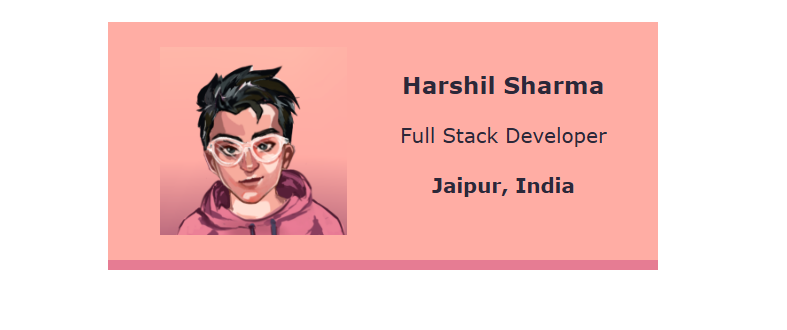
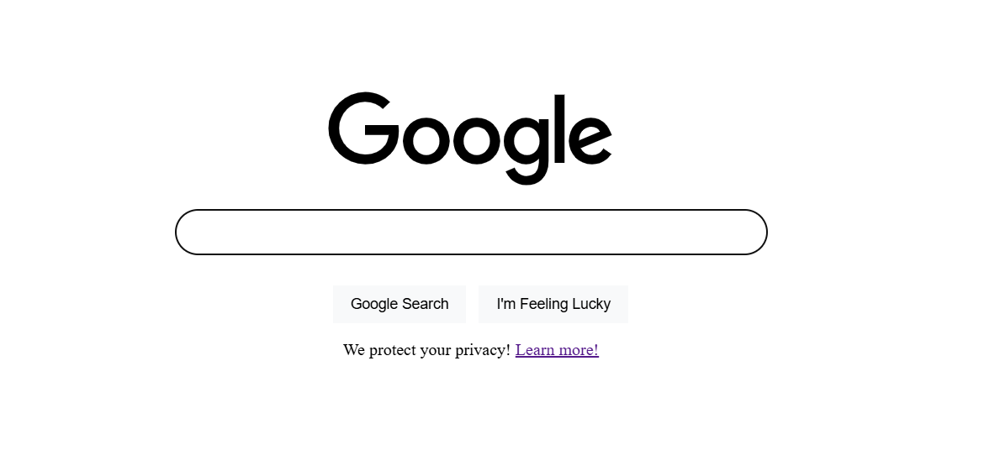
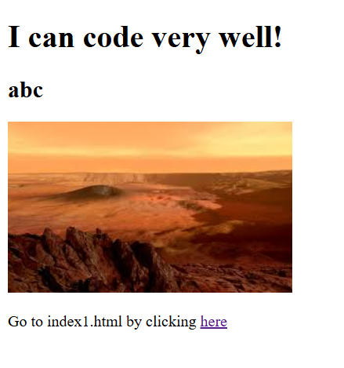

# HTML & CSS Practice Projects

A collection of **mini-projects and exercises** where I strengthened my fundamentals in **HTML & CSS** through hands-on practice. Each project focuses on a specific concept, from basic page structure to responsive design and layout techniques.

---

## How does each practice project look like?

### [6. Birthday Gift](./6_birthday-gift)
<video src="./6_birthday-gift/123.mp4" autoplay loop width="600"></video>

---

### [5. Space Exploration Site](./5_space-exploration-site)

---

### [4. Business Card](./4_business-card)

---

### [3. Portfolio Page](./3_portfolio)

---

### [2. Google Homepage Clone](./2_google)

---

### [1. Start Page](./1_start)

